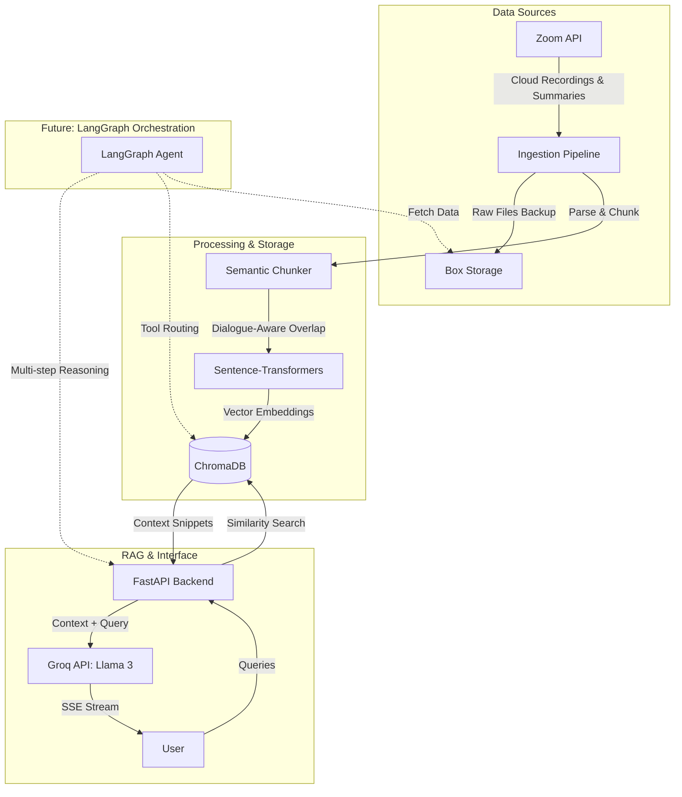

# AI Meeting Intelligence Pipeline

AI Meeting Intelligence Pipeline is a highly sophisticated AI Organizational Memory and Meeting Intelligence Assistant. It serves as a centralized "Second Brain" for organizations by automatically indexing meeting transcripts and making them instantly queryable through a powerful Retrieval-Augmented Generation (RAG) interface.

## System Architecture

The system is designed with a robust pipeline that handles data ingestion, semantic processing, and low-latency querying.

### 1. Ingestion & Storage Pipeline
- **Zoom Cloud Integration**: Securely interfaces with the Zoom API using Server-to-Server OAuth to fetch recent cloud recordings, transcripts (WebVTT), and AI Companion summaries.
- **Box Storage Integration**: Acts as a secure, long-term data lake for raw meeting artifacts. Authenticates via Server-to-Server CCG (Client Credentials Grant) or JWT, creating a resilient backup of all organizational knowledge.

### 2. Semantic Processing & Chunking Strategy
To ensure the LLM receives the most relevant and coherent context, we employ an advanced **Dialogue-Aware Semantic Chunking** strategy:
- **Speaker Preservation**: The parser understands WebVTT and JSON summary structures, extracting dialogue blocks while stripping irrelevant timestamps and metadata.
- **Sliding Window Overlap**: Transcripts are chunked with a sliding overlap. This prevents mid-sentence breaks and ensures context flows naturally between chunks.
- **Contextual Prefixing**: Every chunk is injected with a rich context header (`[Meeting: Topic | Date: YYYY-MM-DD]`). This crucial RAG technique ensures the LLM never loses track of *when* or *where* a statement was made, even when analyzing isolated chunks.
- **Embedding Model**: We utilize local `sentence-transformers` (via ChromaDB's default embedding function) for privacy-preserving, high-quality vector embeddings.

### 3. Retrieval & Generation (RAG)
- **Vector Database**: **ChromaDB** is used as the local vector store for fast, semantic similarity searches across thousands of meeting chunks.
- **LLM Engine**: We leverage the ultra-fast **Groq API** running the state-of-the-art **Llama 3.3 70B Versatile** model for high-level reasoning and synthesis.
- **Streaming Responses**: The backend uses Server-Sent Events (SSE) to stream tokens directly to the frontend, resulting in near-instantaneous perceived latency.

### 4. Advanced Orchestration (LangGraph Integration)
As the system evolves, **LangGraph** will play a crucial role in enabling advanced agentic behaviors:
- **Multi-Step Reasoning**: Enabling the system to cross-reference multiple meetings and perform recursive searches if the initial query doesn't yield sufficient context.
- **Tool Use & Routing**: Allowing the AI to dynamically decide whether to query the vector database for specific topics, fetch a specific summary from Box, or trigger a new ingestion pipeline based on user intent.
- **Stateful Conversations**: Maintaining deep conversational state across complex, multi-turn organizational research tasks to build long-term memory.

## Tech Stack
- **Backend**: Python, FastAPI
- **AI/ML**: ChromaDB, Sentence-Transformers, Groq API (Llama 3.3 70B)
- **Integrations**: Zoom API, Box SDK
- **Frontend**: HTML5, Vanilla JavaScript, CSS3
